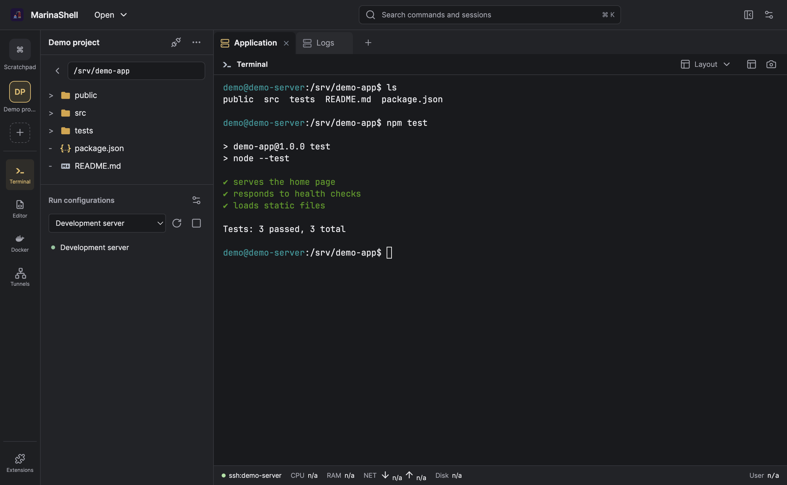

# MarinaShell

MarinaShell is a lightweight Electron desktop SSH client focused on fast, reliable remote terminal workflows. It combines a persistent SSH terminal (xterm.js + node-pty), a remote file explorer, and an optional inline CodeMirror editor for local and SSH files.

## Screenshot



The screenshot uses a fictional host, sample files, and simulated terminal output.
Regenerate it with `env -u ELECTRON_RUN_AS_NODE npx electron scripts/capture-demo.js`.

## Features

- **SSH host picker**: Loads and parses `~/.ssh/config` (supports `Include` and inline comments).
- **Interactive terminal**: Full shell via `ssh` in a PTY (supports resize and interactive TTY behavior).
  - HTTP(S), `www`, and email addresses become hover-underlined, clickable links
  - Right-click menu for opening/copying links, copying selections, selecting all, and clipboard-aware paste
- **Remote file explorer**:
  - Lazy-loaded directory tree over SFTP
  - Pagination for huge folders (`pageSize`)
  - Folder click sends `cd <path>` to the active terminal
  - File click opens using configurable “open modes” (inline CodeMirror, remote shell, local download, local command, or `sftp://` URI)
  - File-type icons in the tree
- **Bundled CodeMirror editor plugin**:
  - Enable or disable it in Settings → Plugins, then choose “Use as default”
  - Opens local and SSH files directly in a dock view with syntax highlighting and multiple editor tabs
  - Right-click editing menu with clipboard-aware Cut, Copy, Paste, Delete, and Select all
  - Syntax-aware indentation and completion for JavaScript/TypeScript and Python, plus in-document key completion for JSON/YAML
  - YAML highlighting, JSON syntax diagnostics, and a visible Ctrl+Space completion action
  - Detects and preserves LF/CRLF line endings; status controls expose indentation width/style and line-ending conversion
  - Saves over the active local/SFTP session; no remote helper or server-side editor is required
  - Detects outside changes before saving and offers reload/overwrite resolution
  - Preserves unsaved drafts while switching files or dock views and warns before closing the app
  - Accepts UTF-8 text files up to 5 MB; binary files remain available through the other open modes
- **Tunnels extension**: independent saved SSH profiles for local, remote, and SOCKS forwarding. Start/stop profiles from the left tool rail; closing a project leaves its tunnels running.
- **Saved projects**: use Open → New project to configure named directories across local and different SSH hosts. Open → Open project reconnects the sessions, changes directories, and restores the saved split layout. Open projects appear above the divider in the left tool rail; their menu saves, edits, or closes the project.
- **File context menus**: Open in editor and Tail last 500 lines are available for terminal filenames/selected paths and explorer files. Tail opens a separate terminal on the same host.
- **Port cleanup**: configurations can optionally kill TCP listeners on a specified port before launch or restart. This is disabled by default, requires `lsof` on the execution host, and does not use sudo.
- **Configuration editor**: compact Run, Environment, Before launch, and Projects tabs, an independent configuration list, and an always-visible save footer.
- **Run sidebar**: configuration dropdown and launch controls beneath Files; active runs appear as a compact list with green dots. Terminal and Layout share one header.
- **Process list**: search for Show Process List to inspect local or SSH processes. Sort by CPU, RAM, disk throughput or cumulative disk I/O; filter by name/user/PID or exact local port. Requires Python 3 on macOS/Linux hosts; `lsof` supplies port information. Restricted counters display —.
- **Workspace navigation**:
  - Charcoal surfaces with an amber active-state accent
  - Search sessions, tools, and plugin commands with `Cmd/Ctrl+K`
  - Choose visible project tabs with `Cmd/Ctrl+1` through `9`; cycle with `Cmd/Ctrl+Tab` and reverse with `Cmd/Ctrl+Shift+Tab`
  - Customize each tab position, next/previous tab, and search in Settings → Shortcuts; an empty binding disables it
  - macOS reserves Cmd+Tab for app switching, so Ctrl+Tab / Ctrl+Shift+Tab also work with the default cycle bindings
  - Discover installed extensions from the rail; configure them in Settings
  - Tools retain their view state when switching within a pane
  - Disconnected terminals offer Reconnect using the same local/SSH host and directory; choose a different connection from Open → Connect to…
- **Multi-tab sessions**:
  - Dedicated session tab strip above the workspace, with compact Beekeeper-style tabs for the selected project
  - Choose horizontal scrolling (default) or multiple rows in Settings → UI → Tab overflow
  - Multiple SSH tabs (each tab has its own terminal + SFTP session)
  - Interpolated tab titles with host, current folder/path, terminal title, and slice syntax such as `<current_folder_name[:15]>`
  - Named tab groups with 1×1, 2×1, 1×2, and 2×2 live terminal grids
  - Drag-and-drop tab ordering and right-click tab renaming
  - Per-tab color labels plus a configurable default color for new tabs
  - Optional “restore tabs on launch”
- **Connections**: Open → Connect to… opens the local/SSH connection picker. Bookmarks and recent-location lists are removed from the interface.
- **Quality-of-life**:
  - Collapsible Files sidebar, persistent tool rail, and a Layout menu
  - Right-click tree context menu: copy remote path
  - Drag & drop local files into the tree to upload (SFTP)
  - Terminal links require Command+click on macOS or Ctrl+click elsewhere
  - Terminal copy/paste (Cmd/Ctrl+C copies selection, Cmd/Ctrl+V pastes)

## Tech stack

- Electron
- Node.js (>= 18)
- xterm.js
- CodeMirror 6
- node-pty
- ssh2 + ssh2-sftp-client

## Project layout

- Main process:
  - `main.js` (entrypoint)
  - `main/app.js` (window + IPC wiring)
  - `main/services/` (SSH config, sessions, stores)
- Renderer:
  - `renderer/index.js` (boot)
  - `renderer/components/` (Files panel, Actions panel, Session tabs)
  - `renderer/services/` (settings, persistence, editor open behavior, icon mapping)
- Bundled plugins:
  - `plugins/editor/` (CodeMirror dock view plus local/SFTP read and save handlers)
- UI:
  - `index.html` (main window)
  - `settings.html` + `settings.js` (settings window)
- Assets:
  - `assets/icons/` (app icon + file-type icons)

## Settings & persistence

Unused workspace groups are cleaned up automatically on startup and as tabs change. If leftover entries appear, use **Settings → Workspace → Clean up unused groups**. This preserves open sessions, active groups (including groups with the same name), and the saved project library.

- **Settings file**: `~/.marinashell/settings.json`
- **State file** (known hosts, recents/saved, tab restore data): Electron user data folder
  - macOS: `~/Library/Application Support/MarinaShell/state.json`
  - Windows: `%APPDATA%\\MarinaShell\\state.json`
  - Linux: `~/.config/MarinaShell/state.json`

Settings are stored as nested objects with `{ type, value }` per field.

## Requirements

### Common

- Node.js >= 18
- `ssh` must be available on PATH
- A working SSH config at `~/.ssh/config` (optional, but recommended)

### macOS

- Xcode Command Line Tools (for native module builds):
  - `xcode-select --install`

### Windows

- Windows 10/11
- “Build Tools for Visual Studio” (C++ build tools) for native modules
- OpenSSH client (built-in on modern Windows)

### Linux

- Build essentials for native modules, e.g.:
  - Debian/Ubuntu: `sudo apt-get install -y build-essential python3 make g++`
  - Fedora: `sudo dnf install -y @development-tools python3`
- `openssh-client` installed

## Run locally

```bash
npm install
npm run start:gui
```

Run the inline editor browser-level smoke test with `npm run test:editor`.

Notes:
- `postinstall` runs `electron-builder install-app-deps` to rebuild native modules for Electron.
- If you run into native module build issues, remove `node_modules` and reinstall:
  - `rm -rf node_modules package-lock.json && npm install`

## Build a release (macOS DMG / others)

```bash
npm run dist
```

Outputs go to `release/`.

This project is **not code-signed** by default. For distribution outside your machine, you’ll want to configure signing + notarization in `package.json`’s `build.mac` settings.

## Usage tips

- **Connect**: pick a host from the dropdown and click Connect.
- **Navigate**:
  - Click a folder in the tree to `cd` into it.
  - Use the path bar to enter a full path and press Enter.
  - Use back/forward buttons to move through directory history.
- **Tree context menu**:
  - Right-click any item → Copy path
  - Right-click a folder → Save folder
- **Drag & drop upload**:
  - Drag local files onto a folder in the tree to upload into that remote folder.
- **Open files**:
  - Controlled by Settings → Editor (mode + file associations).
  - To edit inside MarinaShell, enable the bundled `editor` plugin and click **Use as default** on its plugin card.
  - Large-file warning triggers above 2MB (configurable in code).

## Troubleshooting

- **No SSH hosts appear**
  - Confirm `~/.ssh/config` exists and contains `Host <alias>` blocks.
  - Run: `npm run test:ssh-config`
- **SFTP says “Not connected”**
  - SFTP session is created on Connect; check that the SSH host is reachable and auth works.
- **Electron logs SSL handshake errors**
  - These can be normal Chromium background networking logs; MarinaShell disables background networking, but some platforms may still emit them.

## License

No license specified.


## Run configurations

Enable **run-configurations** in **Settings → Plugins**. It ships disabled and stores its library in `~/.marinashell/run-configurations.json`. The toolbar provides configuration selection, Run, Restart, Stop, Edit configurations, and a run list for reopening output.

- Templates: Python script/module, Celery, Uvicorn, Flask, Node script/module, npm script, and shell script/commands.
- Choose local or an SSH alias, working directory, arguments, and interpreter. **Detect** finds common Python/Node/shell installations, conda/mamba/micromamba environments, pyenv versions, and nvm installations; the picker lists only environments of the selected environment manager. Custom manager and interpreter paths are also accepted, and a stale manager path falls back to a `PATH` lookup at launch.
- Launching does not open a terminal tab. Runs appear in a status indicator next to the configuration dropdown (green dot while running); open it to show, refocus, or clear a run's output tab. Output tabs are read-only, with selection/copy and Find.
- Terminal links recognize absolute file paths (tracebacks, `path:line`) — click one to open the file in the CodeMirror editor. Local files open without a terminal session; remote paths need a connected tab on that host.
- Node module mode imports the module with the selected Node interpreter. For a package CLI, use its entry script or an npm script.
- **Before run — setup scripts**: optional scripts you add yourself, each run before launch in the shell you pick (`bash` or `zsh`). Variables a script exports are applied to the run — this is how `.autoenv.zsh`-style activation files (which may `source` other files or run an environment-manager `activate`) contribute settings. Later scripts override earlier ones, and variables edited under **Environment variables** win over all of them. Only variables a script actually adds or changes are applied; the launch header reports the applied count or the script's exit status, never values, and a failing script does not block the launch. Nothing is detected or enforced automatically — add only scripts you trust.
- `.env` paths resolve on the execution host, relative to the working directory. Files load in order, then setup scripts, then modal variables override them. Values are literal (no shell expansion). Create `.env` never overwrites an existing file. Shell startup files are sourced by the selected shell.
- **Group defaults**: with a configuration shown in a tab group, *Save current values as group defaults* stores its working directory, interpreter/manager, `.env` files, setup scripts, and system-environment choice under that group in `~/.marinashell/run-group-defaults.json`. New configurations created while a tab of that group is active are prefilled from them, and the editor offers *Apply* for one-click adoption. Defaults live in shelldock's library, never inside the project directory.
- **Detect** also scans the working directory for project hints — entry-point directories (`src/` with `app.py`, `manage.py`, …), `.autoenv*`/`.envrc`/`.env` files, and a project-local `.venv` — and offers them as clickable suggestions. Nothing is applied until you click a suggestion.
- **Allow multiple instances** is off by default. Single-instance Run reuses the existing run; multiple-instance Run adds another entry to the run indicator. Restart keeps an already-open output view attached.
- Output is read-only, with selection/copy and Find. Stop requests termination of the managed job; Stop again force-kills it. Closing a tab or group asks for confirmation and keeps the view open until termination is confirmed.
- SSH **Run in tmux** is off by default and requires the installed/enabled tmux plugin plus tmux on the remote host. A named session is reused with a dedicated managed window per run. Reconnecting resumes the output log and verifies status, without automatically launching a duplicate.
- Run records are stored separately in `~/.marinashell/run-records.json`; per-run status and output live under `~/.marinashell/runs/` on the execution host. Logs retain approximately 4–8 MB per run. Older output may rotate. Launch scripts containing inline environment variables use owner-only permissions and are removed after exit.
- Process control uses a Bash supervisor that owns the job, not name-based `pkill` or blind signaling of saved PIDs. Unknown/disconnected runs must be rechecked before controlling them. Programs should run in the foreground; deliberately daemonized children are outside the managed job.
- The runner currently targets **macOS/Linux hosts with Bash**, including POSIX SSH hosts when the client runs on Windows. Native Windows execution hosts are not supported. tmux persistence covers SSH loss, not remote reboots. Ordinary runs are stopped on app quit; tmux runs remain remote until stopped or their tab is explicitly closed.
- Saved project snapshots are independent in `~/.marinashell/saved-groups.json`. Restoring configuration tabs does not execute them.

Validation: `npm run test:runs`, `npm run test:runs:ssh` (requires local tmux; uses an isolated loopback SSH server/socket), and `npm run test:workspace` (Electron UI plus real local processes).

### Agent access (MCP)

Enable **MCP server** in Plugins, then open **Settings → Agent access**. Pair an agent, choose its tool permissions and project/host/configuration scope, save, and start the server. Nothing is exposed by default. The **Connect your agent** guide provides copyable instructions for Codex, Claude Code and ZCode.

- Local Streamable HTTP endpoint, paired bearer tokens encrypted using the system credential store, immediate token rotation/revocation, and per-agent **Hidden / Ask / Allow** permissions.
- Start/Stop and optional restoration of the last running state on app startup. MarinaShell must remain running on the agent's computer.
- Scoped terminal lists/scrollback, visible-terminal screenshots, saved/open projects, split layouts, configuration creation/launch/restart/stop, managed run output and process lists. Run tools use the existing run manager; enable Run configurations to expose them.
- Ask opens an approval in MarinaShell for the exact action. Allow for launch/restart is tied to the saved configuration revision; save permissions again after edits. Port cleanup and force termination have separate permissions. Creating and running configurations permits code execution on the allowed host.
- Screenshots capture one visible terminal, never the desktop or Settings, and are blocked while dialogs are open. Managed run output tabs must be closed in the app; project close requires its runs to have stopped.
- Write requests carry a durable request ID. A retry reports the previous operation status rather than executing it again; inspect the current state before issuing another ID after a timeout.

Validation: `npm run test:mcp` exercises the official SDK against both the server and the real Electron app. Protocol support is negotiated by the pinned SDK (latest supported revision: 2025-11-25). [Implementation details and remaining extensions](docs/plans/mcp-server-plugin.md).

In the Processes window, **Kill** requests a normal stop. Click it again for the same process to confirm **Force stop**. Process identity is checked before signalling; unavailable identities disable the action.

**Tail last 500 lines** opens an always-on-top Logs window from terminal and explorer file menus. Enable **Follow** to watch new lines (including file rotation); uncheck it to return to a snapshot. Closing the window stops its stream. The viewer retains up to 2 MB of recent output.

Select Editor with **Cmd/Ctrl + E**, select Terminal with **Cmd/Ctrl + T**, and create a new terminal with **Cmd/Ctrl + Alt + T**. Customize or disable these in **Settings → Shortcuts**.
